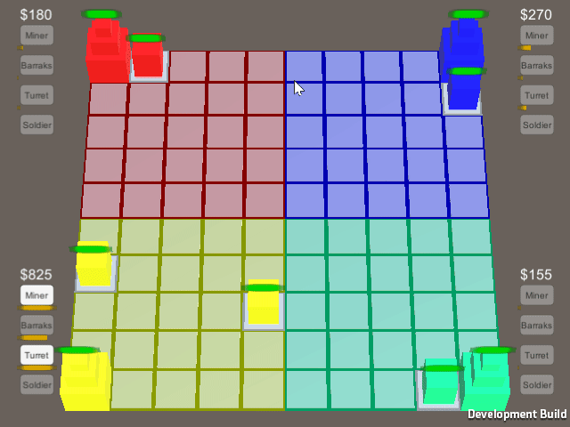

### AI Env - SimpleStrategy, SimplePlatformer
Game Environments for testing AI

## DESCRIPTION:

Strategy game environment used for testing AI against the basic elements of a strategy game and platformer.

## REQUIREMENTS:

- Unity
- Python (with dependencies)
- Tensorflow Sharp
- Jupyter
This project requires Tensorflow Sharp found here:
 * [ML-Agents with TensorflowSharp Plugin](https://s3.amazonaws.com/unity-ml-agents/0.3/ML-AgentsWithPlugin.unitypackage)
 * [ML-Agents without TensorflowSharp Plugin](https://s3.amazonaws.com/unity-ml-agents/0.3/ML-AgentsNoPlugin.unitypackage)
 * [TensorflowSharp Plugin Only](https://s3.amazonaws.com/unity-ml-agents/0.3/TFSharpPlugin.unitypackage)

## INSTALLATION:
The machine learning base project was pulled from the Unity ML-Agents github, and the instructions for setting up the project can be found here:
https://github.com/Unity-Technologies/ml-agents/tree/master/docs

## GAME: 

Simple Strategy
- Destroy enemy castle to win.
- Players can only build in their zone.
- Create Mining building to generate income.
- Create a Barracks to produce soldiers.
- Creating Turrets for defense 
- Directed Soldiers to attack enemy bases.

Simple Platformer
- Get Key 
- Go to the green door

## SETTINGS:

The globalSpeed can be adjusted in GameManager for rapid simulation.

## PREVIEW:

    

 
 

