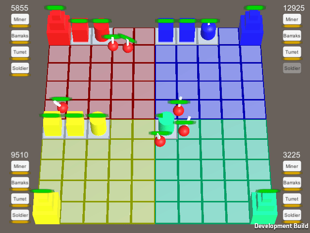

### AI Env - SimpleStrategyGame
Game Environments for testing AI

###DESCRIPTION:

Strategy game environment used for testing AI against the basic elements of a strategy game.

###REQUIREMENTS:

- Unity
- Python (with dependencies)
- Tensorflow Sharp
- Jupyter
This project requires Tensorflow Sharp found here:
https://github.com/Unity-Technologies/ml-agents/blob/master/docs/Using-TensorFlow-Sharp-in-Unity.md

###INSTALLATION:
The machine learning base project was pulled from the Unity ML-Agents github, and the instructions for setting up the project can be found here:
https://github.com/Unity-Technologies/ml-agents/tree/master/docs

###GAME GOAL: 

Destroy enemy castle.

###GAME FEATURES:

- Mining
- Building
- Creating Soldiers
- Creating Defences
- Directed Attacks

###SETTINGS:

The globalSpeed can be adjusted in GameManager for rapid simulation.

###TODO:

- Simplify agent controls as there are too many options for the agent to try, which sometimes leading to no movement at all.

###PREVIEW:

    

    

 
 

